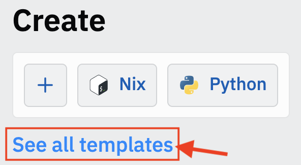

# March 31, 2022
[Home](./index.md)

## Graphics

We will use a module called [PyGame](https://www.pygame.org/docs/){:target="_blank"}.

Start by creating a replit using the Pygame template.



Search for the "pygame" template. It might give you 2 choices. You can choose either one.

Paste the following lines:
```python
import sys, pygame

pygame.init()   # start pygame

# (width, height) of our graphics window
width = 400
height = 300

# Create the graphics window
screen = pygame.display.set_mode((width, height))
```

We are going to draw a circle. The circle's position will be stored in `x` and `y`.
```python
# Position of circle
x = 50  # x coordinate
y = 50  # y coordinate
```

Now let's draw on the screen.
```python
#-----Paint the screen-----

# Background
screen.fill((0,0,0))

# Draw a circle at position (x, y)
pygame.draw.circle(screen, (255,100,100), (x, y), 20)

# We have to ask pygame to display our drawings
pygame.display.flip()
```
It's like you draw on the back of a piece of paper, and then **flip** it over once you're done drawing. Then you draw on the back again.

---

## Animation
We do animation by drawing frames very quickly.

**Challenge**

Here is a loop that draws the circle at position `(x, y)`. Add 1 to each of `x` and `y` inside the loop, so that the circle shifts every time you draw it.

```python
import sys, pygame

pygame.init()  # start pygame

# (width, height) of our graphics window
width = 400
height = 300

# Create the graphics window
screen = pygame.display.set_mode((width, height))

# Position of circle
x = 50  # x coordinate
y = 50  # y coordinate

for k in range(100):
    # Update the location BELOW

    #-----Paint the screen-----
    # Background
    screen.fill((0, 0, 0))
    # Draw a circle at position (x, y)
    pygame.draw.circle(screen, (255, 100, 100), (x, y), 20)
    # We have to ask pygame to display our drawings
    pygame.display.flip()
    # Ask pygame to slow down so we can see movement
    pygame.time.Clock().tick(60)
```
That last line (with `tick`) stops the computer from running too fast. Instead, it tells it to draw frames at a certain rate (60 frames per second, in this case).
<details><summary>Solution</summary>
<pre><code>    # Update the location BELOW
    x = x + 1
    y = y + 1</code></pre>
</details>

---

## Bouncing

Change the line
```python
for k in range(100):
```
to
```python
while True:
```
This will keep the ball moving forever (or until you hit "Stop"). Unfortunately, the ball moved off the screen. Let's fix that.

**Challenge**

Add if-statements inside the loop that reverses the direction of motion when the ball hits the edges of the screen. Remember that the screen is `x=0` on the left, `x=width` on the right, `y=0` at the top, and `y=height` at the bottom.

<details>
<summary>Solution</summary>
<code>import sys, pygame

pygame.init()  # start pygame

\# (width, height) of our graphics window
width = 400
height = 300

\# Create the graphics window
screen = pygame.display.set_mode((width, height))

\# Position of circle
x = 50  # x coordinate
y = 50  # y coordinate

vx = 1  # x velocity
vy = 1  # y velocity

while True:
    # Update the location BELOW
    x = x + vx
    y = y + vy

    if x<0 or x>width:
        vx = -vx
    if y<0 or y>height:
        vy = -vy

    #-----Paint the screen-----
    # Background
    screen.fill((0, 0, 0))
    # Draw a circle at position (x, y)
    pygame.draw.circle(screen, (255, 100, 100), (x, y), 20)
    # We have to ask pygame to display our drawings
    pygame.display.flip()
    # Ask pygame to slow down so we can see movement
    pygame.time.Clock().tick(60)</code>
</details>
